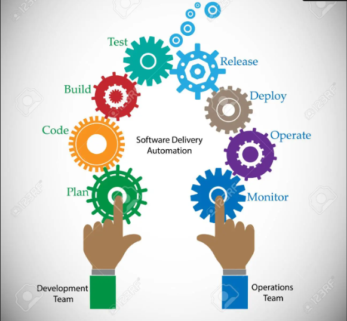
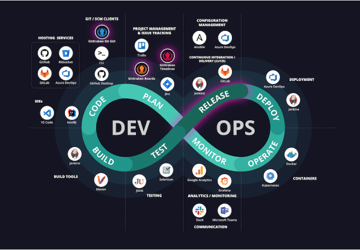

# ResumendeDevOps

## Contenido:

### ¿Que es?

DevOps es una cultura, práctica y filosofía que tiene como objetivo integrar y automatizar el desarrollo de software y
la entrega continua a los usuarios finales. En DevOps, los equipos de desarrollo de software y los de operaciones
trabajan juntos para crear y entregar software de alta calidad en un proceso integrado y automatizado.

### ¿Para que sirve?

Su objetivo principal es mejorar la calidad y rapidez de la entrega de software, reducir los tiempos de desarrollo y
despliegue, y aumentar la colaboración entre equipos. DevOps busca crear una cultura de trabajo en equipo, en la que los
desarrolladores y los ingenieros de operaciones trabajen juntos para garantizar una entrega continua de software de alta
calidad.

### ¿Beneficios y contras?

Entre los beneficios de DevOps se encuentran: mejoras en la calidad del software, mayor velocidad en la entrega,
reducción de costos, mayor eficiencia, y mayor colaboración. Por otro lado, algunos de los contras pueden incluir la
necesidad de una gran inversión inicial en herramientas y tecnologías, y la necesidad de una mayor colaboración y
comunicación entre los equipos.

### Herramientas de devops

Las herramientas de DevOps son software que automatizan y simplifican el proceso de desarrollo, pruebas y despliegue de
software. Algunas herramientas populares son: Jenkins, Git, Docker, Ansible, Puppet, Chef, entre otras. Estas
herramientas pueden ayudar a los equipos DevOps a implementar y automatizar los flujos de trabajo de desarrollo, pruebas
y despliegue de software.

### Equipos devops

Los equipos DevOps están compuestos por desarrolladores, ingenieros de operaciones y otros miembros del equipo de TI que
trabajan juntos para desarrollar, probar y desplegar software de manera eficiente. Los equipos de DevOps buscan integrar
los procesos de desarrollo y operaciones para garantizar que el software se entregue de manera rápida y eficiente.

### ¿Que son pipelines?

Los pipelines son flujos de trabajo automatizados que permiten la entrega continua de software. Estos pipelines son
creados por los equipos DevOps y se utilizan para integrar, probar y desplegar el código en diferentes ambientes, desde
pruebas hasta producción. Los pipelines incluyen una serie de etapas o pasos, como la integración continua, pruebas
unitarias, pruebas de integración, pruebas de aceptación, y despliegue de software en producción. Estos pipelines
permiten que el software se entregue de manera rápida y eficiente a los usuarios finales.

### ejemplos de pipeline

Algunos ejemplos de pipelines incluyen: el proceso de compilación y empaquetado de una aplicación, la realización de
pruebas unitarias y de integración, y la implementación de actualizaciones y parches de seguridad en un sistema en
producción. Los equipos DevOps pueden crear pipelines personalizados para adaptarse a sus necesidades específicas y
garantizar la entrega continua y eficiente de software de alta calidad.
