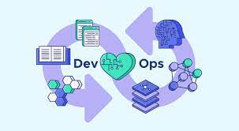

# Resumen de DevOps 

Contenido:

## Contenido
1. [¿Qué es DevOps?](#qué-es-devops)
2. [¿Para qué sirve DevOps?](#para-qué-sirve-devops)
3. [Beneficios y Contras](#beneficios-y-contras)
    - [Beneficios](#beneficios)
    - [Contras](#contras)
4. [Herramientas de DevOps](#herramientas-de-devops)
    - [Herramientas](#herramientas)
5. [Equipos DevOps](#equipos-devops)
    - [Roles comunes](#roles-comunes)
6. [¿Qué son los `pipelines`?](#qué-son-los-pipelines)
7. [Ejemplos de `pipelines`](#ejemplos-de-pipelines)

- - -

# ¿Qué es DevOps?

DevOps es una mentalidad cultural y colaborativa que hace énfasis en la comunicación, la colaboración, la integración y
la automatización entre los equipos de desarrollo y operaciones para lograr una entrega de software más rápida y fiable.

DevOps no es un cargo o función específicos, sino un conjunto de prácticas y principios que pueden aplicarse a diversas
funciones en el desarrollo de software y las operaciones de TI. Cualquiera que participe en el proceso de desarrollo y
entrega de software puede adoptar una mentalidad DevOps y aplicar prácticas DevOps en su trabajo, incluidos
desarrolladores, probadores, ingenieros de operaciones y otros.

Facilitando una cultura de colaboracion y responsabilidad compartida, acelerando la integracion y el despliegue de aplicaciones
A traves de automatizacion, feedBack rapido y mejora iterativa. Representa un Cambio en cuanto a la cultura de IT de una organizacion, fundamentandose en practicas y conceptos de desarrollo agil, Su exito depende de la habilidad de crear una cultura de comunicacion y empatia entre los miembros del equipo.

DevOps es una metodología de desarrollo de software que se enfoca en la colaboración y la comunicación entre los equipos
de desarrollo y operaciones. Su objetivo es crear un entorno en el que los equipos trabajen juntos de manera eficiente
para lograr un ciclo de vida de desarrollo de software más rápido y confiable. DevOps combina las prácticas de
desarrollo ágil, automatización de la infraestructura, integración continua y entrega continua, monitoreo y
retroalimentación continua para ayudar a las empresas a ofrecer productos y servicios de alta calidad de manera más
rápida y eficiente.

# ¿Para qué sirve DevOps?

Bajo un modelo de DevOps, los equipos de desarrollo y operaciones ya no están “aislados”. A veces, los dos equipos se fusionan en uno solo, donde los ingenieros trabajan en todo el ciclo de vida de la aplicación, desde el desarrollo y las pruebas hasta la implementación y las operaciones, y desarrollan una variedad de habilidades no limitadas a una única función.
En algunos modelos de DevOps, los equipos de control de calidad y de seguridad también se integran más con el desarrollo y las operaciones e intervienen durante todo el ciclo de vida de la aplicación. Cuando la seguridad es la prioridad de todos los miembros de DevOps, a veces se conoce como operaciones de seguridad de desarrollo.
Los equipos utilizan prácticas para automatizar los procesos que anteriormente habían sido manuales y lentos. Utilizan una pila de tecnología y herramientas que los ayudan a operar y mejorar aplicaciones de forma rápida y confiable. Además, estas herramientas ayudan a los ingenieros a realizar de forma independiente tareas que normalmente hubieran requerido la ayuda de otros equipos (por ejemplo, implementar código o aprovisionar infraestructura), lo que incrementa todavía más la velocidad del equipo.

# Beneficios y Contras

Entre los beneficios de DevOps se incluyen la entrega de software de manera más rápida y frecuente, la mejora de la
calidad del software, la reducción de costos y la mejora en la colaboración y comunicación entre equipos. Sin embargo,
la implementación de DevOps puede ser costosa y requiere tiempo y recursos significativos. Además, la transición de una
cultura tradicional a una cultura DevOps puede ser difícil para algunos miembros del equipo, y la automatización puede
no ser adecuada para todas las situaciones.

## Beneficios

- **Entrega rápida y confiable de software:** DevOps permite a los equipos de desarrollo y operaciones trabajar juntos
  para implementar software de manera rápida y confiable. La automatización y las pruebas continuas permiten detectar y
  solucionar problemas en etapas tempranas del ciclo de vida del software, lo que reduce el tiempo de inactividad y los
  errores en producción.
- **Mayor colaboración y visibilidad:** DevOps fomenta la colaboración y la comunicación entre los equipos de desarrollo
  y operaciones, lo que aumenta la visibilidad en la aplicación y su entorno. Esto permite detectar problemas y
  solucionarlos en tiempo real, lo que mejora la calidad del software.
- **Flexibilidad y escalabilidad:** DevOps permite una mayor flexibilidad y escalabilidad en la implementación de
  software. Las herramientas y prácticas de automatización permiten implementar aplicaciones en diferentes entornos de
  manera fácil y rápida.
- Mayor eficiencia: DevOps fomenta la automatización de procesos y la eliminación de tareas manuales redundantes, lo que aumenta la eficiencia del equipo y reduce el tiempo de entrega.  
- **Reducción de costos:** La automatización y la detección temprana de problemas permiten reducir el costo de
  reparación de errores en producción, lo que a su vez reduce el costo total de desarrollo y operación de software.

## Contras

- **Inversión inicial en herramientas y automatización:** La implementación de DevOps puede requerir una inversión
  significativa en herramientas y automatización, lo que puede ser costoso para algunas empresas.
- **Cambio cultural:** La adopción de DevOps puede requerir un cambio cultural en la organización. Es necesario fomentar
  la colaboración y la comunicación entre los equipos de desarrollo y operaciones, lo que puede llevar tiempo y
  esfuerzo.
- **Gestión de la complejidad:** La implementación de DevOps puede aumentar la complejidad del proceso de implementación
  de software. Es necesario gestionar y monitorear la infraestructura y los sistemas en tiempo real, lo que puede ser un
  desafío para algunas organizaciones.
-**Riesgos de seguridad: La automatización y la entrega continua pueden aumentar el riesgo de vulnerabilidades de seguridad si no se implementan medidas adecuadas de seguridad y pruebas. Los equipos de DevOps deben asegurarse de que se implementen medidas adecuadas para mitigar estos riesgos. Aquí es donde surge DevSecOps a partir de las vulnerabilidades de seguridad a lo largo del ciclo de vida de desarrollo del software
  Herramientas de devops

Los beneficios de DevOps superan los contras y es por eso que se ha convertido en una metodología muy popular en la
industria del software. La implementación correcta de DevOps puede aumentar la calidad y la velocidad de entrega de
software, lo que a su vez puede mejorar la satisfacción del cliente y la rentabilidad de la empresa.

## Principios DevOps

En general, lo que siempre queremos con devops es mejorar la frecuencia de nuestros despliegues, acelerar el time to Market, disminuir la tasa de errores en las nuevas entregas al tener una cobertura alta de pruebas automatizadas, reducir los tiempos entre correcciones, dado que tenemos herramientas de monitoreo que nos permiten encontrar errores y además, tenemos una forma muy rápida y automatizada de desplegar, además también cuando tenemos errores o caídas en producción, pues nos vamos a poder recuperar fácilmente y rápido ante estas caídas. 

# Herramientas de DevOps

Las herramientas de DevOps incluyen herramientas de automatización de la infraestructura, integración continua y entrega
continua, monitoreo y retroalimentación continua. Algunas de las herramientas más populares incluyen Jenkins, Git,
Docker, Ansible, Chef, Puppet, Nagios y ELK Stack. Estas herramientas ayudan a los equipos de DevOps a automatizar los
procesos de desarrollo y entrega, mejorar la calidad del software y aumentar la eficiencia del equipo.

## Herramientas

- **De control de versiones:** Git es la herramienta de control de versiones más utilizada en DevOps. Permite a los
  equipos colaborar en el desarrollo de código fuente y realizar un seguimiento de los cambios a lo largo del tiempo.
  Otras herramientas de control de versiones populares incluyen SVN y Mercurial.

- **De integración continua y entrega continua (CI/CD):** Jenkins y Travis CI son dos de las herramientas más utilizadas
  para la integración continua y entrega continua en DevOps. Estas herramientas automatizan el proceso de compilación,
  pruebas y despliegue de software, lo que permite a los equipos implementar software de manera rápida y confiable.

- **De monitoreo y análisis de logs:** Elasticsearch, Kibana y Logstash (también conocido como "ELK Stack") son
  herramientas populares para el monitoreo y análisis de logs en DevOps. Estas herramientas permiten a los equipos
  monitorear y analizar el rendimiento y la disponibilidad de sus aplicaciones, lo que les permite identificar y
  solucionar problemas de manera proactiva.

- **De automatización de infraestructura:** Ansible, Puppet y Chef son herramientas populares para la automatización de
  la infraestructura en DevOps. Estas herramientas permiten a los equipos automatizar la configuración y gestión de sus
  sistemas, lo que reduce los errores y el tiempo de inactividad.

- **De gestión de contenedores:** Docker es una herramienta popular para la gestión de contenedores en DevOps. Los
  contenedores son una forma de empaquetar y distribuir aplicaciones, lo que permite a los equipos implementar software
  de manera rápida y confiable en diferentes entornos.

La elección de las herramientas adecuadas depende de las necesidades específicas de cada equipo y proyecto. Es
importante seleccionar las herramientas adecuadas para la implementación de DevOps y asegurarse de que se integren bien
con otras herramientas y procesos existentes en la organización.

# Equipos DevOps

Los equipos DevOps están compuestos por desarrolladores, administradores de sistemas, ingenieros de operaciones y otros
miembros del equipo de TI que trabajan juntos para lograr un ciclo de vida de desarrollo de software más rápido y
confiable. Estos equipos son responsables de la planificación, desarrollo, prueba, implementación y monitoreo de
aplicaciones y sistemas. Los equipos DevOps también están enfocados en la automatización de procesos y en la
colaboración entre equipos.

El enfoque DevOps se centra en la colaboración y comunicación estrecha entre los equipos de desarrollo y operaciones,
por lo que la estructura de un equipo DevOps suele ser interdisciplinaria, con miembros de ambos equipos trabajando
juntos.

A continuación, se describen algunos de los roles más comunes en un equipo de DevOps:

Desarrolladores: Son responsables de escribir y probar el código del software. Trabajan en colaboración con los miembros del equipo de operaciones para garantizar que el código sea compatible con la infraestructura de producción.

Administradores de sistemas: Son responsables de configurar, implementar y mantener la infraestructura de TI necesaria para ejecutar y entregar el software. A menudo, trabajan en colaboración con los desarrolladores para garantizar que la infraestructura sea compatible con el software.

Ingenieros de automatización: Son responsables de la creación y el mantenimiento de herramientas y procesos de automatización para agilizar y optimizar el desarrollo, prueba y entrega de software.

Ingenieros de seguridad: Son responsables de garantizar la seguridad del software y la infraestructura de TI. Trabajan en colaboración con los desarrolladores y administradores de sistemas para identificar y mitigar posibles vulnerabilidades.

Ingenieros de calidad: Son responsables de garantizar la calidad del software entregado, a través de la implementación de pruebas automatizadas y de la integración continua.

Líder de proyecto: Es responsable de supervisar el progreso del proyecto, la gestión de recursos, la planificación y coordinación de actividades, y la toma de decisiones clave.

## Roles comunes

- **Desarrolladores de software:** los desarrolladores de software son responsables de crear y mantener el código fuente
  del software. Trabajan con otros miembros del equipo DevOps para integrar el código en el pipeline y asegurarse de que
  el software se entregue de manera rápida y confiable.

- **Ingenieros de operaciones:** los ingenieros de operaciones son responsables de la infraestructura y el entorno de
  producción en el que se ejecuta el software. Trabajan con otros miembros del equipo DevOps para garantizar que el
  entorno de producción sea seguro, escalable y confiable.

- **Especialistas en automatización:** los especialistas en automatización son responsables de la automatización de
  procesos y tareas repetitivas en el pipeline de DevOps. Trabajan con herramientas de automatización y scripting para
  reducir los errores y el tiempo de inactividad.

- **Especialistas en seguridad:** los especialistas en seguridad son responsables de garantizar que el software se
  entregue de manera segura y cumpla con los estándares de seguridad de la organización. Trabajan con otros miembros del
  equipo DevOps para implementar medidas de seguridad y pruebas de seguridad en el pipeline.

Es importante tener en cuenta que los roles y responsabilidades pueden variar según la organización y el proyecto
específico. Los equipos DevOps deben ser flexibles y capaces de adaptarse a medida que cambian las necesidades de la
organización. Además, la colaboración y comunicación efectiva son fundamentales para el éxito de un equipo DevOps, por
lo que es esencial fomentar un entorno de trabajo abierto y colaborativo.

# ¿Qué son los `pipelines`?

Los pipelines son flujos de trabajo automatizados que integran diferentes herramientas y procesos de desarrollo de
software en un solo proceso continuo. Los pipelines comienzan con la compilación de código fuente y terminan con la
implementación y monitoreo en producción. Los pipelines están diseñados para garantizar que el software se construya,
pruebe y entregue de manera rápida y confiable. Los pipelines de DevOps son altamente personalizables y se pueden
adaptar a las necesidades específicas de cada equipo.

Un pipeline de DevOps es un conjunto automatizado de procesos que permiten la integración continua, la entrega continua
y el despliegue continuo (CI/CD) de un software. El objetivo principal del pipeline es automatizar el proceso de entrega
de software, lo que reduce los errores y acelera el tiempo de comercialización. El pipeline de DevOps comienza con la
integración continua, que se encarga de integrar el código fuente del software en un repositorio compartido. Una vez que
se integra el código, el pipeline pasa a la fase de pruebas, donde se ejecutan pruebas automatizadas para detectar
errores y verificar que el software se ajusta a las especificaciones requeridas.

Si las pruebas automatizadas son satisfactorias, el pipeline continúa con la fase de entrega continua, que se encarga de
compilar el código fuente, crear un paquete de software y desplegarlo en un entorno de preproducción para realizar
pruebas adicionales. Finalmente, si el software pasa todas las pruebas en el entorno de preproducción, el pipeline
continúa con la fase de despliegue continuo, que se encarga de desplegar el software en un entorno de producción en
vivo.

Los pipelines de DevOps pueden incluir una variedad de herramientas y tecnologías, como Git para control de versiones,
Jenkins para automatización de construcción y Bamboo para automatización de despliegue. Los pipelines de DevOps son una
forma eficaz de automatizar el proceso de entrega de software, lo que permite a los equipos de desarrollo y operaciones
trabajar juntos de manera más eficiente y ofrecer software de alta calidad de manera más rápida y confiable.

Un pipeline típico de DevOps se divide en las siguientes etapas

1.	Construcción: se compila y empaqueta el código fuente.
2.	Pruebas: se ejecutan pruebas automatizadas para verificar que el código cumple con los requisitos funcionales y no presenta errores.
3.	Integración: se integra el código con otros componentes del sistema para asegurarse de que todos los elementos funcionen juntos.
4.	Despliegue: se implementa el código en un entorno de prueba o de producción.
5.	Monitoreo: se monitorea el rendimiento de la aplicación en tiempo real para detectar errores o problemas.
Fuente: https://devopslatam.com/que-es-un-pipeline-de-ci-cd/

# Ejemplos de `pipelines`

Pipeline para una aplicación web: Este pipeline puede tener etapas para la compilación del código fuente, la ejecución de pruebas de integración y de rendimiento, el empaquetado de la aplicación en un contenedor, la implementación en un ambiente de pruebas y la implementación en producción. 

Pipeline para una aplicación móvil: Este pipeline puede tener etapas para la compilación del código fuente, la ejecución de pruebas automatizadas, la generación de builds para diferentes plataformas móviles, la implementación en un ambiente de pruebas y la implementación en la tienda de aplicaciones. 

Pipeline para una infraestructura de TI: Este pipeline puede tener etapas para la creación de infraestructura, la instalación y configuración de software, la ejecución de pruebas automatizadas y la implementación en un ambiente de producción.

Un pipeline de seguridad que se enfoca en el análisis de seguridad del código. El pipeline incluye tareas como análisis estático de código, análisis de vulnerabilidades y pruebas de penetración.

Otro ejemplo de pipeline es el proceso de compilación y empaquetado de una aplicación, la realización de pruebas unitarias y de integración, y la implementación de actualizaciones y parches de seguridad en un sistema en producción. Los equipos DevOps pueden crear pipelines personalizados para adaptarse a sus necesidades específicas y garantizar la entrega continua y eficiente de software de alta calidad.

**Algunas recomendaciones para facilitar la implementación de DevOps**

1. Fomentar una cultura de colaboración: La colaboración entre los equipos de desarrollo, operaciones y otros involucrados es fundamental para el éxito de DevOps. Anime a la comunicación abierta, la transparencia y la colaboración para derribar los silos tradicionales.

2. Adoptar metodologías ágiles y Lean: Implemente prácticas ágiles y Lean en el desarrollo de software y la gestión de proyectos, lo que permite iteraciones rápidas, adaptabilidad a los cambios y la entrega de valor de manera continua.

3. Automatizar procesos: Automatice la mayor cantidad posible de procesos, desde la integración continua, las pruebas, la entrega y el despliegue, hasta la monitorización y la gestión de la infraestructura. La automatización reduce errores humanos y mejora la eficiencia en todo el ciclo de vida del software.

4. Implementar Infraestructura como Código (IaC): Utilice herramientas y técnicas de IaC para automatizar la configuración, el aprovisionamiento y la gestión de la infraestructura de TI, lo que permite una mayor consistencia y control sobre los entornos de desarrollo, pruebas y producción.

5. Establecer métricas y monitoreo: Monitoree y mida el rendimiento, la disponibilidad y la seguridad de las aplicaciones y la infraestructura en tiempo real. Establezca métricas clave de rendimiento (KPI) para evaluar el éxito de la implementación de DevOps y ajustar las prácticas según sea necesario.

6. Integrar la seguridad desde el principio: Incluya prácticas de seguridad en cada etapa del ciclo de vida del desarrollo, en lugar de tratarlas como un proceso separado. Fomente la colaboración entre los equipos de desarrollo, operaciones y seguridad para garantizar que la seguridad sea una parte integral de la estrategia de DevOps.

7. Capacitar y formar al personal: Proporcione a los empleados la capacitación y los recursos necesarios para desarrollar habilidades en las áreas de DevOps, como automatización, IaC, monitoreo y seguridad. Esto puede incluir la realización de talleres, la contratación de expertos en la materia o el fomento de la formación continua.

8. Aprender de los errores y mejorar continuamente: Fomente una cultura de aprendizaje y mejora continua, donde los equipos puedan experimentar, aprender de sus errores y buscar oportunidades para mejorar sus prácticas y procesos.

9. Comenzar con pequeños proyectos piloto: Inicie la implementación de DevOps en proyectos pequeños y menos críticos antes de escalar a proyectos más grandes y complejos. Esto permitirá a la organización aprender y ajustar las prácticas de DevOps sin poner en riesgo proyectos críticos.

10. Obtener apoyo y compromiso de la dirección: La adopción de DevOps puede requerir cambios significativos en la cultura y las prácticas de una organización. Asegúrese de obtener el apoyo y el compromiso de la dirección para garantizar que los equipos cuenten con los recursos y el respaldo necesario para implementar DevOps de manera exitosa.

En resumen, DevOps es un enfoque integral que busca mejorar la calidad, la velocidad y la eficiencia en el desarrollo y la entrega de software, al tiempo que fomenta la colaboración y la comunicación entre los equipos de desarrollo y operaciones. La adopción de DevOps puede conducir a una mayor competitividad y éxito en el mercado, al permitir a las organizaciones adaptarse rápidamente a las cambiantes demandas del mercado y satisfacer las necesidades de sus clientes de manera más efectiva.

- - -
🐢

<a href="https://gitmoji.dev">
  
  
  